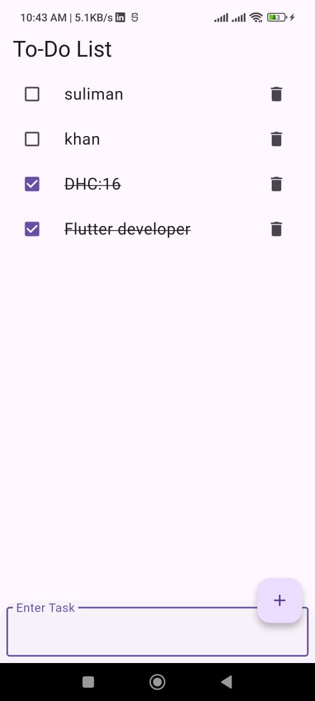

# 📝 To-Do List App

A simple and efficient **To-Do List App** built with **Flutter** and **Hive database**.  
This app allows users to add, delete, and manage daily tasks with a clean and minimal UI.  

---

## 🚀 Features
- Add new tasks  
- Mark tasks as completed ✅  
- Delete tasks 🗑️  
- Persistent storage using **Hive** (offline support)  
- Responsive and user-friendly design  

---

## 📸 Screenshots
 Home Screen
 

---

## 🛠️ Technologies Used
- [Flutter](https://flutter.dev/) - UI framework  
- [Hive](https://docs.hivedb.dev/) - Lightweight local NoSQL database  
- [Provider](https://pub.dev/packages/provider) - State management  

Internship: DevelopersHub Corporation

Author:
Suliman khan
DHC: 16 
Flutter Developer